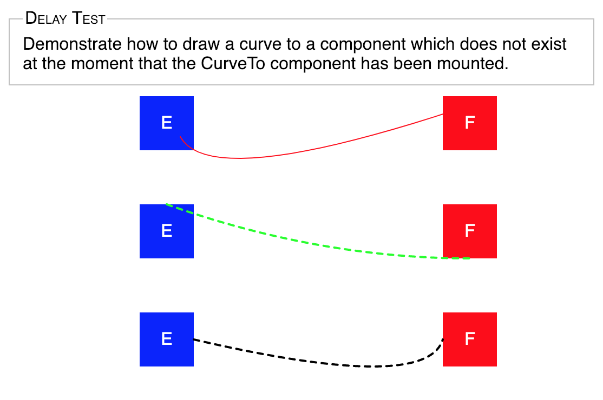

[](https://www.npmjs.com/package/react-curveto)
[](https://travis-ci.org/JedWatson/react-curveto)

# React-CurveTo

Draw a curve/line between two elements in React.
Fork and modify from react-lineto

<center>
  
</center>

# Installation and usage

The easiest way to use react-curveto is to install it from npm and build it into your app with Webpack.

```
yarn add react-curveto
```

Then use it in your app:

```js
import React from 'react';
import CurveTo from 'react-curveto';

class App extends React.Component {
render() {
    return (
            <div>
                <div className="A">Element A</div>
                <div className="B">Element B</div>
                <CurveTo
                        from="A"
                        to="B"
                        fromAnchor="top"
                        toAnchor="bottom"
                        borderColor="#000"
                        borderStyle="dotted"
                        borderWidth={2}
                        delay={0}
                        curveFrom={[50, 50]}
                        curveTo={[-100, -50]}
                    />
            </div>
        );
    }
}
```
#### Props

| Name        | Type   | Description                                    | Example Values
| ----------- | ------ | ---------------------------------------------- | --------------
| borderColor | string | Border color                                   | `#f00`, `red`, etc.
| borderStyle | string | Border style                                   | `solid`, `dashed`, etc.
| borderWidth | number | Border width (px)                              |
| className   | string | Desired CSS className for the rendered element |
| delay       | number or bool | Force render after delay (ms)          | `0`, `1`, `100`, `true`
| fromAnchor  | string | Anchor for starting point (Format: "x y")      | `top right`, `bottom center`, `left`, `100% 0`
| from\*      | string | CSS class name of the first element            |
| toAnchor    | string | Anchor for ending point (Format: "x y")        | `top right`, `bottom center`, `left`, `100% 0`
| to\*        | string | CSS class name of the second element           |
| within      | string | CSS class name of the desired container        |
| zIndex      | number | Z-index offset                                 |
| curveFrom\* | array  | Cubic control point offset, default [0,0]      | [0,0], [50,-50], etc.
| curveTo\*   | array  | Cubic control point offset, default [0,0]      | [0,0], [50,-50], etc.

\* Required

# Thanks

Thank you to everyone who has contributed to this project. It's been a wild ride.

## License

MIT Licensed. Copyright (c) Quang Dinh 2019.